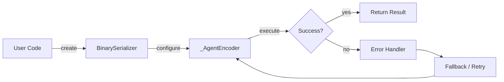
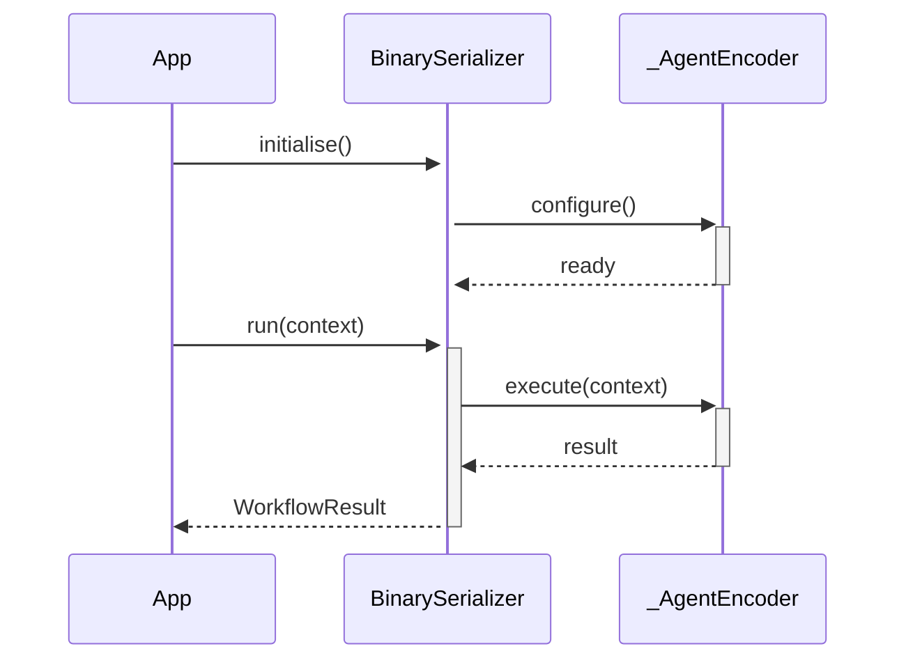

<div align="center">

</div>

# agent-serializer

**Production-grade serialization and deserialization for agent data**

[](https://pypi.org/project/agent-serializer/) [](https://python.org) [](LICENSE) [](#)

---

## The Problem

Without a shared serializer, agent messages use ad-hoc JSON that breaks on floats, datetimes, and nested objects. Version mismatches between sender and receiver produce silent data corruption that only surfaces in production.

## Installation

```bash
pip install agent-serializer
```

## Quick Start

```python
from agent_serializer import BinarySerializer, _AgentEncoder

# Initialise
instance = BinarySerializer(name="my_agent")

# Use
# see API reference below
print(result)
```

## API Reference

### `BinarySerializer`

```python
class BinarySerializer(Serializer):
    """MessagePack-style binary serializer using ``json`` + ``gzip``.
    def pack(self, obj: Any) -> bytes:
        """Serialize *obj* to compressed bytes."""
    def unpack(self, data: bytes) -> Any:
        """Decompress and deserialize *data* back to Python objects."""
    def size_reduction(self, obj: Any) -> float:
        """Return the compression ratio as a fraction (0–1).
```

### `_AgentEncoder`

```python
class _AgentEncoder(json.JSONEncoder):
    """JSON encoder that handles agent-specific types."""
    def __init__(self, *args, registry: dict | None = None, **kwargs):
    def default(self, obj: Any) -> Any:  # noqa: ANN401
def _decode_hook(registry: dict, obj: dict) -> Any:  # noqa: ANN401
        """Object hook for J
```


## How It Works

### Flow



### Sequence



## Philosophy

> Brahman is ineffable, yet the Vedas serialized the cosmos into *rk, saman, yajus* — structure enables transmission.

---

*Part of the [arsenal](https://github.com/darshjme/arsenal) — production stack for LLM agents.*

*Built by [Darshankumar Joshi](https://github.com/darshjme), Gujarat, India.*
